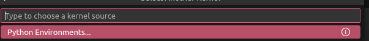

# Installation
this project will be using uv package manager 
```bash
# On macOS and Linux.
curl -LsSf https://astral.sh/uv/install.sh | sh
```
```bash
# On Windows.
powershell -ExecutionPolicy ByPass -c "irm https://astral.sh/uv/install.ps1 | iex"
```
More info on the [UV GitHub](https://github.com/astral-sh/uv?tab=readme-ov-file)

To make sure that the `uv` command available you need to reload the terminal or powerShell.
# First run
Run the following command in the `src` directory to install the dependencies:
```bash
uv sync
```
This will be installing all the dependencies listed in the `pyproject.toml` file and will create a virtual environment for the project.

Make sure that the version of python you are using is at least 3.10+ 

Now you can proceed using the `Usage` section.

# Usage
## Jupyter Notebook (Traditional)
For using the project kernel, you can either use the standart ways of jupyter by creating a kernel by using the following command:
```bash
uv run --with jupyter jupyter lab
```

## Jupyter Notebook (VS Code)
Or if you are using VS Code, you can use the plugin [Jupyter](https://marketplace.visualstudio.com/items?itemName=ms-toolsai.jupyter) to run the notebooks directly in VS Code.

This method will allow you to the notebooks interface directly in VS Code. 

As for the kernel,
you can either use the traditional method (see above) then copy the http://localhost:8888/?token=... link to the browser.

Or with the `ipykernel` package (that is already installed in the project) you can select the kernel located in the `.venv/bin/python` directory (or `src/.venv/bin/python` for certain systems).


into 

